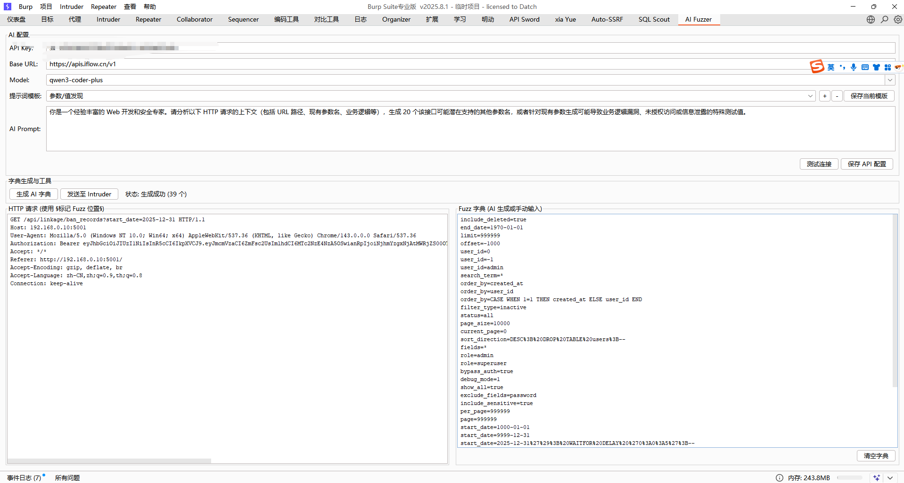
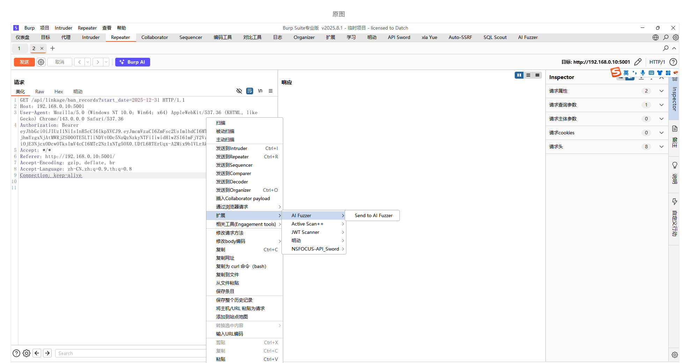
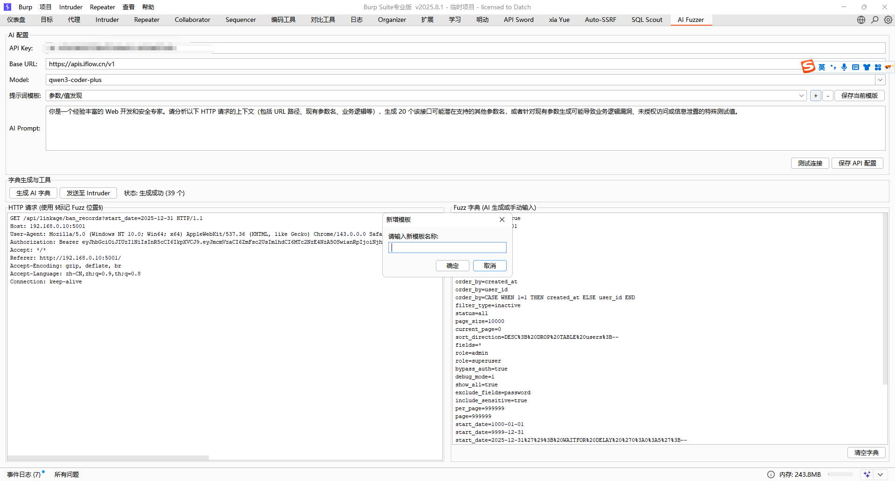
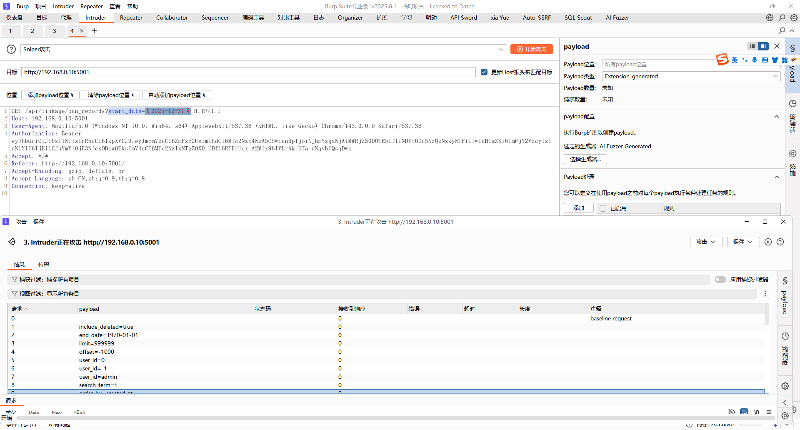

# Burp AI Fuzzer



一个基于 AI 驱动的 Burp Suite 渗透测试辅助插件，旨在利用大语言模型（LLM）的上下文理解能力，为复杂的 HTTP 请求自动生成针对性的 Fuzz 字典。

## 🌟 核心特性

- **智能字典生成**：支持 OpenAI (GPT-3.5/4) 和 Claude (Opus/Sonnet) 等主流模型，自动解析请求上下文生成高质量 Fuzz 字典。
- **强制规则约束**：内置底层提示词约束，确保 AI 仅输出纯净的 Payload 列表，自动处理 `§` 标记位的针对性生成。
- **多模板管理**：内置通用、SQL 注入、XSS 等提示词模板，支持用户自定义新增、编辑和删除模板，模板数据持久化在本地 JSON 文件中。
- **便捷标记工具**：请求编辑器支持右键“一键标记”，快速为参数添加 `§` 定界符。
- **Intruder 深度集成**：支持通过 `§` 标记 Fuzz 位置，一键发送至 Intruder，并作为 Intruder 的自定义 Payload 数据源。
- **配置持久化**：API 配置自动保存至 Burp 全局设置，模板数据独立存储，方便迁移和备份。

## 🚀 快速开始

### 1. 编译项目
项目使用 Maven 管理依赖，你可以直接运行：
```bash
mvn clean package
```
编译完成后，在 `target/` 目录下会生成 `ai-fuzzer-1.0-SNAPSHOT-jar-with-dependencies.jar`。

### 2. 安装插件
1. 打开 Burp Suite。
2. 进入 `Extensions` -> `Installed` -> `Add`。
3. 选择 `Java` 类型，并加载上述编译好的 JAR 文件。

### 3. 配置 AI

1. 切换到 `AI Fuzzer` 标签页。
2. 填写你的 API Key、Base URL（如 `https://api.openai.com/v1`）以及模型名称。
3. 点击 `保存配置` 并点击 `测试连接` 确保 API 正常。

## 🛠 使用说明

### 1. 发送请求至 AI Fuzzer
在 Burp 的 Proxy、Repeater 或其他模块中，右键点击请求，选择 `Send to AI Fuzzer`。


### 2. 标记位置与模版选择
1. 在插件编辑框中，使用 `§` 包裹你想测试的参数值，例如 `id=§1001§`。
2. 选择合适的提示词模版，或点击 `管理模板` 自定义你的 Fuzz 逻辑。


### 3. 生成与集成爆破
1. 点击 `生成 AI 字典`，Payload 列表将自动填充。
2. 点击 `发送至 Intruder`，插件将自动同步请求和 Payload。

3. 在 Intruder 的 `Payloads` 选项卡中，确保 `Payload type` 为 `Extension-generated`，并选择 `AI Fuzzer Generated`。

## 📝 许可证

[MIT License](LICENSE)
